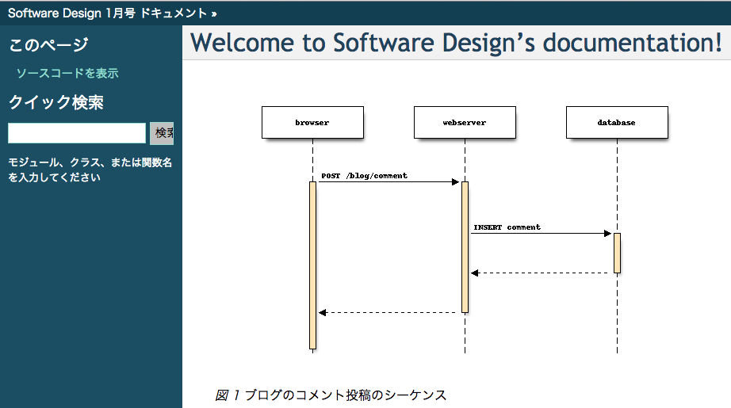

Markdown を使うには？
=====================

reST の代わりに Markdown を使うことも可能です。ただし Sphinx ディレクティブが使えない為、 toctree にぶらさげるだけの利用方法となります。

    Python 拡張「recommonmark」のインストール ::

        pip install recommonmark

    conf.py の編集 ::

      from recommonmark.parser import CommonMarkParser

      source_parsers = {
          '.md': CommonMarkParser,
      }

      source_suffix = ['.rst', '.md']

この設定により、拡張子 .md のファイルはrecommonmarkパーサーで読み込まれるようになります。

次に :numref:`markdown-sample` の内容をSphinxプロジェクトのディレクトリに ``sample.md`` というファイル名で保存します。

.. literalinclude:: files/sample.md
   :caption: sample.md
   :name: markdown-sample

このサンプルでは画像の埋め込みを行っています。
``sphinx-flow.png`` というファイル名で画像を用意して、sample.mdと同じディレクトリに置いて下さい。

次に、トップページからリンクするために ``index.rst`` の ``.. toctree::`` と書かれている付近を :numref:`index-rst-modify` のように編集します。

.. code-block:: rst
   :caption: index.rst の変更部分
   :name: index-rst-modify

   .. toctree::
      :maxdepth: 2

      sample

Sphinxで使えるMarkdown記法
===========================

オリジナルのMarkdown [#markdown]_ はJohn Gruber氏が開発しました。
MarkdownはHTMLマークアップを覚えなくても、読み書きしやすいテキストベースのシンプルな記法から、HTML 文書を簡単に生成するために作られました。
HTMLは文章に対して「マークアップ」して装飾や意味を「書き加えていく」ことで、デザインや構造などを表現します。これに対して、Markdownは装飾や意味を表す記述をそぎ落として、できるだけ簡単な記述で書きつつ、同様の結果を得られるようになっています。

このように、オリジナルのMarkdownはシンプルな記法を目指して作られましたが、それゆえテーブル記法もなく表現力が不足しているため、多くの派生Markdown記法が生まれました。有名なのは、GitHub Flavored Markdown (GFM) [#github-markdown]_  やPHP Markdown Extra [#php-markdown-extra]_ などでしょう。そして、Markdownの標準化と機能強化を目指すCommonMark [#commonmark]_ の策定が2014年に始まりました。現在のところ、CommonMark記法はオリジナルの記法よりも表現力はあるものの、テーブル記法はまだサポートされていません。これからの議論で仕様が標準化されていくことが期待されています。 :numref:`features-for-markups` は、マークアップによって表現できることの差異についてまとめたものです。

.. list-table:: マークアップごとの記法の違い
   :name: features-for-markups

   * * 表現
     * CommonMark
     * GFM
     * reST

   * * 強調、斜体、インラインリテラル
     * ○
     * ○
     * ○

   * * 絵文字、チェックボックス、打ち消し線
     * ×
     * ○
     * ×

   * * 箇条書き
     * ○
     * ○
     * ○

   * * 定義リスト、フィールドリスト、オプションリスト
     * ×
     * ×
     * ○

   * * 引用ブロック
     * ○
     * ○
     * ○

   * * 画像表示
     * ○
     * ○
     * ○

   * * URLリンク
     * △ (専用記法が必要)
     * ○ (直接記述も可能)
     * ○ (直接記述も可能)

   * * ページ内リンク
     * △
     * △
     * ○

   * * ページ内目次
     * ×
     * ×
     * ○

   * * 相互参照
     * ×
     * ×
     * ○

   * * テーブル表記
     * ×
     * ○
     * ○

   * * 脚注
     * ×
     * ×
     * ○

   * * 番号付き参照
     * ×
     * ×
     * ○

   * * HTMLタグ
     * ○ (直接記述)
     * ○ (直接記述)
     * ○ (rawディレクティブで可能)

   * * コメントアウト
     * △ (HTMLのコメントアウトを使う)
     * △ (HTMLのコメントアウトを使う)
     * ○

   * * 外部ファイルinclude
     * ×
     * ×
     * ○ (include, literalinclude)

   * * role、ディレクティブによる記法拡張
     * ×
     * ×
     * ○

   * * テキストからの図生成
     * ×
     * ×
     * Sphinx拡張で可能

本ドキュメントでは ``recommonmark`` パーサーを使用しています。このパーサーは、名前の通りCommonMark記法をサポートしています。

.. [#markdown] http://daringfireball.net/projects/markdown/syntax
.. [#php-markdown-extra] https://michelf.ca/projects/php-markdown/extra/
.. [#github-markdown] https://help.github.com/articles/github-flavored-markdown/
.. [#commonmark] http://spec.commonmark.org/

SphinxでMarkdown記法を利用するメリット
=======================================

すでにMarkdownでドキュメントを書いている人は、Sphinxを使ってビルドすることによって、HTMLやPDFなどの各種フォーマットへの変換や epub、gettextを利用した他言語への翻訳出力、といったSphinxの機能がすぐに利用できます。また、MarkdownとreSTのどちらも書いたことがない人にとっては、Markdownは記法が少なく覚えやすいので、最初のハードルが低いというメリットがあります。

このようなメリットがあるため、もともとSphinxを使っているけれども人に勧めづらい、組織にSphinxを導入したいけれどreSTを書いてもらうのが難しい、という場合にも、Markdown記法で始めることで導入のハードルを下げられるでしょう。

reST記法を利用するメリットは？
--------------------------------

reStructuredTextは1つのドキュメントソースから様々な出力形式に変換することを目標に作られています。このため、表現の幅はとても広く、その分数多くの記法が用意されています。これまでの連載で紹介してきた範囲だけでも、目次記法、ページ間の相互参照、テーブル記法、図表への自動採番、図表番号の参照、用語集、索引の自動生成、Graphvizによる図の描画などがあります。他にも外部ファイルの埋め込みや脚注など、多くの記法があります。

また、reSTプラグインによって記法を拡張できます。Sphinxはこの仕組みを使って、オリジナルのreSTでは提供されていないいくつかの記法を追加しています。前述の ``.. toctree::`` もそのうちのひとつで、複数あるドキュメントソースファイルを1つのツリー構造に連結することで、ドキュメントの論理構造を決定します。

他にも、有志が作成したSphinx拡張を利用することで、sphinxcontrib-cacooやsphinxcontrib-visio等による外部からの図の埋め込み、sphinxcontrib-seqdiagの専用記法によるシーケンス図の描画(:numref:`seqdiag-usecase2`)、といった機能が使えるようになります。

   ``sphinxcontrib-seqdiag`` の出力結果

こういった機能を利用するには、Markdownではなく、reSTで記述する必要があります。そこで、まずはCommonMark記法でドキュメントを書いていき、それ以上の表現力が必要になった場合には、reSTで記述することを検討してみて下さい。

Markdownは表現力が制限されているからこそ、覚えるのが簡単で始めやすいと言えます。
このように多機能だからといって、全て覚えなければ始められないということはないのですが、全体像を把握しづらいためか「難しい」と感じる人が多いようです。

